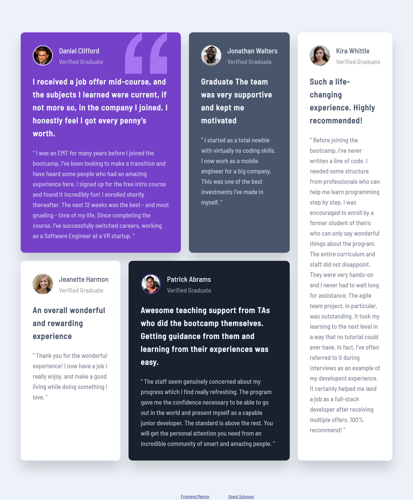

# Frontend Mentor - Testimonials grid section solution

This is a solution to the [Testimonials grid section challenge on Frontend Mentor](https://www.frontendmentor.io/challenges/testimonials-grid-section-Nnw6J7Un7). Frontend Mentor challenges help you improve your coding skills by building realistic projects.

## Table of contents

- [Overview](#overview)
  - [The challenge](#the-challenge)
  - [Screenshot](#screenshot)
  - [Links](#links)
- [My process](#my-process)

  - [Built with](#built-with)
  - [What I learned](#what-i-learned)

  - [Useful resources](#useful-resources)

- [Author](#author)

## Overview

### The challenge

Users should be able to:

- View the optimal layout for the site depending on their device's screen size

### Screenshot



### Links

- Solution URL: [GitHub link](https://github.com/SoloLere/Testimonials-Section.git)
- Live Site URL: [Live site](https://sololere.github.io/Testimonials-Section/)

## My process

### Built with

- Semantic HTML5 markup
- SASS
- CSS custom properties
- CSS Grid
- Mobile-first workflow

**Note: These are just examples. Delete this note and replace the list above with your own choices**

### What I learned

Use this section to recap over some of your major learnings while working through this project. Writing these out and providing code samples of areas you want to highlight is a great way to reinforce your own knowledge.

- grid align content will always have a default value of stretch. To avoid this:

```css
.graduate {
  align-content: start;
}
```

- Whever I use grid areas to specify the ouline of the grid content, my grid columns will have unequal dimensions. To avoid this:

```css
.container {
  grid-auto-columns: 1fr;
}
```

### Useful resources

- [Kevins grid solution](https://youtu.be/rg7Fvvl3taU) - This helped me for to understand the options available for my grid layout. I really liked using grid-template-areas and will use it going forward.

## Author

- Mail - [Solomon oseni mail](jnrolalere@gmail.com)
- Frontend Mentor - [@SoloLere](https://www.frontendmentor.io/profile/@SoloLere)
